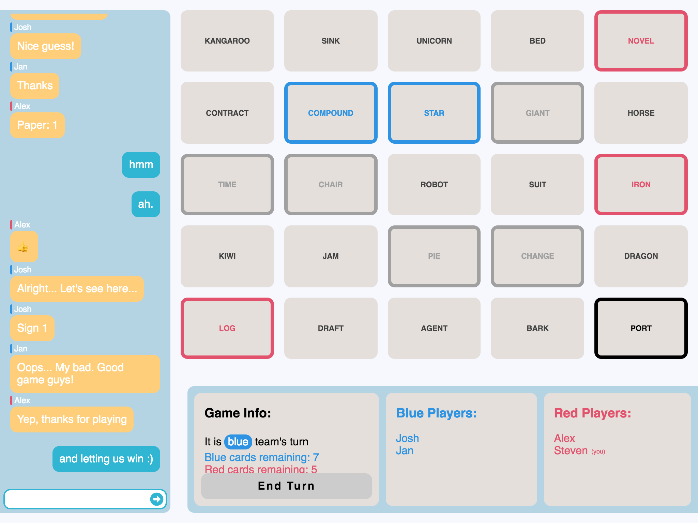

# Codenames

[Codenames](<https://en.wikipedia.org/wiki/Codenames_(board_game)>) is a board game for 4-8 people. The traditional version is played when everybody is at the same spot, but in this modern world, when are people together? This digital version allows you to play with your friends whether you are sitting on the same couch, or on opposite sides of the globe. Additionally, since it works on desktop _and_ mobile devices, you can play on the go.



## Getting Started

Just want to play with your friends? Head to [http://codenamesgo.herokuapp.com/](http://codenamesgo.herokuapp.com/) and get playing!

Want to run your own server? Stay tuned!

### Prerequsites

You'll need to have [Node.js](https://nodejs.org/en/) installed.

### Installing

First, download the repository:

```bash
git clone https://github.com/JosNun/codenames.git # clone the codenames repository
```

Then, you'll want to install the dependencies

```bash
cd codenames # move to the newly-cloned directory
npm install # install the dependencies
```

Finally, you should be able to fire it up.

```bash
npm start
```

## Built With

* [Express](https://expressjs.com/) - Web framework
* [Socket.io](https://socket.io/) - Real-time communication

## Contributing

All contributions are welcome. There's a todo list at the top of `index.js`. I'd be more than happy if you would give me a hand with some of 'em.

## License

This project is licensed under the MIT license - see the [LICENSE](./LICENSE) file for details

## Acknowledgements

* Vlaada Chváti and Czech Games for the great game
* My friends, who got me into the game
